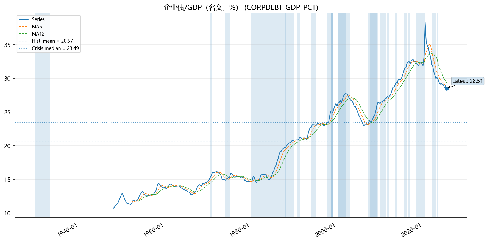
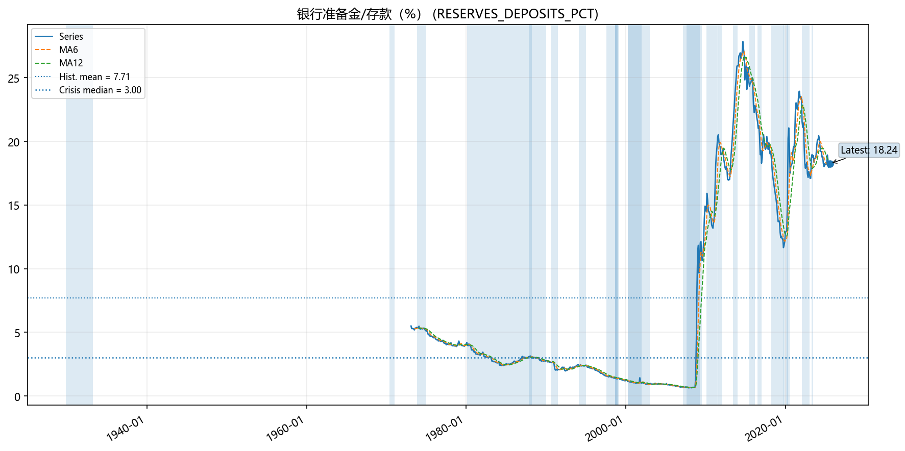
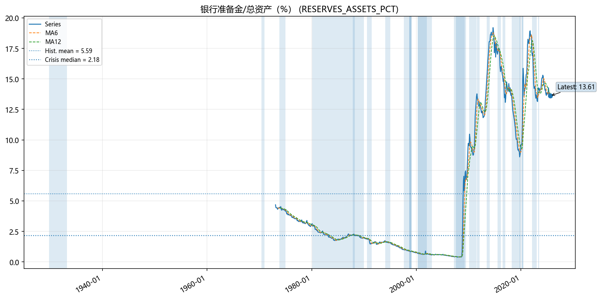

# 🚨 宏观金融危机监察报告

**生成时间**: 2025年09月20日 10:12:20

## 📋 报告说明

本报告基于FRED宏观指标，将当前值与历史危机期间基准值比较，以评估风险。

【数据由人采集和处理，请批判看待这些数据，欢迎email jiangx@gmail.com 任何问题讨论】

风险评分范围 0-100：50 为中性，越高越危险（除非指标设定为'越低越危险'）。

采用分组加权评分：先计算各组平均分，再按权重合成总分。

总分 = ∑(分组平均分 × 分组权重)，分组权重归一处理后合成。

过期数据处理：月频数据>60天、季频数据>120天标记⚠️，过期数据权重×0.9。

颜色分段：0–39 🔵 极低，40–59 🟢 低，60–79 🟡 中，80–100 🔴 高；50 为中性。

## 🎯 总体风险概览

- **加权风险总分**: 46.5/100

- **成功监控指标**: 26/26

### 📊 分组风险评分

- **收益率曲线**: 55.4/100 (权重: 14%, 指标数: 2)

- **利率水平**: 46.0/100 (权重: 14%, 指标数: 5)

- **信用利差**: 38.2/100 (权重: 14%, 指标数: 2)

- **金融状况/波动**: 39.4/100 (权重: 9%, 指标数: 2)

- **实体经济**: 46.5/100 (权重: 14%, 指标数: 2)

- **房地产**: 45.8/100 (权重: 9%, 指标数: 2)

- **消费**: 47.9/100 (权重: 7%, 指标数: 1)

- **银行业**: 41.5/100 (权重: 6%, 指标数: 2)

- **外部环境**: 47.5/100 (权重: 5%, 指标数: 1)

- **杠杆**: 56.5/100 (权重: 9%, 指标数: 1)

**总体风险等级**: 🟢 低风险

## 🟡 中风险指标

### 收益率曲线倒挂: 10年期-3个月 (T10Y3M)
- **当前值**: -0.02 
- **基准值**: 0.59 (noncrisis_p25)
- **风险评分**: 60.8/100  🟡 中风险
- **偏离度**: -0.61
- **历史Z分数**: -1.25
- **方向说明**: 该指标越低越危险

### 密歇根消费者信心 (UMCSENT) ⚠️(过期)
- **当前值**: 61.7 
- **基准值**: 87.1 (noncrisis_p35)
- **风险评分**: 65.0/100  🟡 中风险
- **偏离度**: -25.4
- **历史Z分数**: -1.77
- **方向说明**: 该指标越低越危险

## 🟢 低风险指标

### 收益率曲线倒挂: 10年期-2年期 (T10Y2Y)
- **当前值**: 0.5 
- **基准值**: 0.245 (noncrisis_p25)
- **风险评分**: 50.0/100  🟢 低风险
- **偏离度**: 0.255
- **历史Z分数**: -0.38
- **方向说明**: 该指标越低越危险

### 联邦基金利率 (FEDFUNDS)
- **当前值**: 4.33 
- **基准值**: 5.24 (noncrisis_p75)
- **风险评分**: 47.2/100  🟢 低风险
- **偏离度**: -0.91
- **历史Z分数**: -0.08
- **方向说明**: 该指标越高越危险

### 3个月国债利率 (DTB3)
- **当前值**: 3.95 
- **基准值**: 4.92 (noncrisis_p75)
- **风险评分**: 46.6/100  🟢 低风险
- **偏离度**: -0.97
- **历史Z分数**: -0.08
- **方向说明**: 该指标越高越危险

### 10年期国债利率 (DGS10)
- **当前值**: 4.11 
- **基准值**: 6.03 (noncrisis_p75)
- **风险评分**: 42.9/100  🟢 低风险
- **偏离度**: -1.92
- **历史Z分数**: -0.58
- **方向说明**: 该指标越高越危险

### 30年期抵押贷款利率 (MORTGAGE30US)
- **当前值**: 6.35 
- **基准值**: 7.58 (noncrisis_p75)
- **风险评分**: 45.7/100  🟢 低风险
- **偏离度**: -1.23
- **历史Z分数**: -0.42
- **方向说明**: 该指标越高越危险

### SOFR隔夜利率 (SOFR)
- **当前值**: 4.14 
- **基准值**: 5.31 (noncrisis_p75)
- **风险评分**: 47.8/100  🟢 低风险
- **偏离度**: -1.17
- **历史Z分数**: 0.76
- **方向说明**: 该指标越高越危险

### 高收益债风险溢价 (BAMLH0A0HYM2)
- **当前值**: 2.71 
- **基准值**: 5.605 (crisis_median)
- **风险评分**: 31.8/100  🔵 极低风险
- **偏离度**: -2.895
- **历史Z分数**: -1.01
- **方向说明**: 该指标越高越危险

### 投资级信用利差: Baa-10Y国债 (BAA10YM)
- **当前值**: 1.74 
- **基准值**: 2.27 (crisis_median)
- **风险评分**: 44.7/100  🟢 低风险
- **偏离度**: -0.53
- **历史Z分数**: -0.21
- **方向说明**: 该指标越高越危险

### 芝加哥金融状况指数 (NFCI)
- **当前值**: -0.5638 
- **基准值**: -0.1859 (noncrisis_p75)
- **风险评分**: 42.5/100  🟢 低风险
- **偏离度**: -0.3779
- **历史Z分数**: -0.56
- **方向说明**: 该指标越高越危险

### VIX波动率指数 (VIXCLS)
- **当前值**: 15.7 
- **基准值**: 24.452 (noncrisis_p90)
- **风险评分**: 36.3/100  🔵 极低风险
- **偏离度**: -8.752
- **历史Z分数**: -0.51
- **方向说明**: 该指标越高越危险

### 非农就业人数 YoY (PAYEMS)
- **当前值**: 0.9274 
- **基准值**: 0.2504 (crisis_p25)
- **风险评分**: 47.4/100  🟢 低风险
- **偏离度**: 0.677
- **历史Z分数**: -0.35
- **方向说明**: 该指标越低越危险

### 工业生产 YoY (INDPRO)
- **当前值**: 0.8743 
- **基准值**: -3.0452 (crisis_p25)
- **风险评分**: 45.6/100  🟢 低风险
- **偏离度**: 3.9195
- **历史Z分数**: -0.24
- **方向说明**: 该指标越低越危险

### GDP YoY (GDP) ⚠️(过期)
- **当前值**: 4.6083 
- **基准值**: 3.8535 (crisis_p25)
- **风险评分**: 48.3/100  🟢 低风险
- **偏离度**: 0.7548
- **历史Z分数**: -0.51
- **方向说明**: 该指标越低越危险

### 新屋开工（年化） (HOUST)
- **当前值**: 1307.0 
- **基准值**: 1106.5 (crisis_p25)
- **风险评分**: 45.5/100  🟢 低风险
- **偏离度**: 200.5
- **历史Z分数**: -0.33
- **方向说明**: 该指标越低越危险

### 房价指数: Case-Shiller 20城 YoY (CSUSHPINSA)
- **当前值**: 1.888 
- **基准值**: 4.5889 (crisis_median)
- **风险评分**: 46.0/100  🟢 低风险
- **偏离度**: -2.7009
- **历史Z分数**: -0.45
- **方向说明**: 该指标越高越危险

### 消费者信贷 YoY (TOTALSA)
- **当前值**: 5.4611 
- **基准值**: 7.6617 (noncrisis_p75)
- **风险评分**: 47.9/100  🟢 低风险
- **偏离度**: -2.2006
- **历史Z分数**: 0.33
- **方向说明**: 该指标越高越危险

### 总贷款与租赁 YoY (TOTLL)
- **当前值**: 4.3929 
- **基准值**: 10.091 (noncrisis_p75)
- **风险评分**: 42.1/100  🟢 低风险
- **偏离度**: -5.698
- **历史Z分数**: -0.53
- **方向说明**: 该指标越高越危险

### 美联储总资产 YoY (WALCL)
- **当前值**: -6.6962 
- **基准值**: 4.2045 (crisis_median)
- **风险评分**: 40.9/100  🟢 低风险
- **偏离度**: -10.9007
- **历史Z分数**: -0.66
- **方向说明**: 该指标越高越危险

### 贸易加权美元指数 YoY (DTWEXBGS)
- **当前值**: -0.8552 
- **基准值**: 0.7721 (noncrisis_median)
- **风险评分**: 47.5/100  🟢 低风险
- **偏离度**: -1.6272
- **历史Z分数**: -0.37
- **方向说明**: 该指标越高越危险

### 企业债/GDP（名义，%） (CORPDEBT_GDP_PCT)
- **当前值**: 28.5098 
- **基准值**: 22.0769 (noncrisis_p65)
- **风险评分**: 56.5/100  🟢 低风险
- **偏离度**: 6.4329
- **历史Z分数**: 1.17
- **方向说明**: 该指标越高越危险

### 银行准备金/存款（%） (RESERVES_DEPOSITS_PCT) ⚠️(过期)
- **当前值**: 18.2439 
- **基准值**: 2.3618 (crisis_p25)
- **风险评分**: 40.2/100  🟢 低风险
- **偏离度**: 15.8821
- **历史Z分数**: 1.31
- **方向说明**: 该指标越低越危险

### 银行准备金/总资产（%） (RESERVES_ASSETS_PCT) ⚠️(过期)
- **当前值**: 13.6087 
- **基准值**: 1.5891 (crisis_p25)
- **风险评分**: 40.3/100  🟢 低风险
- **偏离度**: 12.0196
- **历史Z分数**: 1.37
- **方向说明**: 该指标越低越危险

### 家庭债务偿付比率 (TDSP) ⚠️(过期)
- **当前值**: 11.2492 
- **基准值**: 11.6465 (crisis_median)
- **风险评分**: 45.7/100  🟢 低风险
- **偏离度**: -0.3973
- **历史Z分数**: -0.42
- **方向说明**: 该指标越高越危险

### 房贷违约率 (DRSFRMACBS) ⚠️(过期)
- **当前值**: 1.79 
- **基准值**: 2.54 (crisis_median)
- **风险评分**: 45.4/100  🟢 低风险
- **偏离度**: -0.75
- **历史Z分数**: -0.7
- **方向说明**: 该指标越高越危险

## 📅 历史危机期间参考

- **大萧条** (GD_1929): 1929-10-01 至 1933-03-31
  - 1929年股市崩盘引发的大萧条，持续约3.5年
- **商业票据危机/宾州中央铁路** (CP_1970): 1970-05-01 至 1970-12-31
  - 宾州中央铁路破产引发的商业票据市场危机
- **石油危机与滞胀** (OIL_7374): 1973-10-01 至 1974-12-31
  - 第一次石油危机引发的经济衰退和通胀
- **储贷危机** (SANDL_8089): 1980-01-01 至 1989-12-31
  - 储贷机构危机，持续约10年
- **黑色星期一** (CRASH_1987): 1987-10-01 至 1988-03-31
  - 1987年10月19日股市崩盘
- **信贷紧缩衰退** (CREDIT_9091): 1990-07-01 至 1991-06-30
  - 1990-1991年信贷紧缩引发的经济衰退
- **债券市场危机** (BOND_1994): 1994-01-01 至 1994-12-31
  - 1994年债券市场大幅波动
- **LTCM/俄罗斯违约** (LTCM_1998): 1998-08-01 至 1999-02-28
  - 长期资本管理公司危机和俄罗斯债务违约
- **互联网泡沫破裂** (DOTCOM_2000): 2000-03-01 至 2002-12-31
  - 互联网泡沫破裂引发的经济衰退
- **全球金融危机** (GFC_2008): 2007-07-01 至 2009-06-30
  - 2008年全球金融危机，雷曼兄弟破产等
- **欧债危机** (EURO_2011): 2011-07-01 至 2012-01-31
  - 欧洲主权债务危机
- **美国回购市场危机** (REPO_2019): 2019-09-01 至 2019-10-31
  - 2019年9月美国回购市场利率飙升
- **新冠疫情现金争夺** (COVID_2020): 2020-02-15 至 2020-06-30
  - 新冠疫情引发的全球金融市场恐慌
- **地区银行压力** (REG_BANK_2023): 2023-03-01 至 2023-06-30
  - 2023年硅谷银行等地区银行危机
- **亚洲金融危机** (ASIAN_1997): 1997-07-01 至 1998-12-31
  - 1997-1998年亚洲金融危机
- **俄罗斯金融危机** (RUSSIAN_1998): 1998-08-01 至 1998-12-31
  - 1998年俄罗斯债务违约和货币危机
- **科技股崩盘** (TECH_2000): 2000-03-01 至 2001-12-31
  - 科技股泡沫破裂
- **次贷危机** (SUBPRIME_2007): 2007-02-01 至 2008-09-30
  - 次贷危机爆发到雷曼兄弟破产前
- **雷曼兄弟破产** (LEHMAN_2008): 2008-09-01 至 2009-03-31
  - 雷曼兄弟破产引发的全球金融恐慌
- **欧债危机初期** (EUROZONE_2010): 2010-01-01 至 2011-06-30
  - 希腊债务危机引发的欧债危机初期
- **缩减恐慌** (TAPER_2013): 2013-05-01 至 2013-12-31
  - 美联储缩减量化宽松引发的市场恐慌
- **中国股市崩盘** (CHINA_2015): 2015-06-01 至 2016-02-29
  - 中国股市大幅下跌引发的全球市场波动
- **英国脱欧** (BREXIT_2016): 2016-06-01 至 2016-12-31
  - 英国脱欧公投引发的市场波动
- **贸易战** (TRADE_WAR_2018): 2018-03-01 至 2019-12-31
  - 中美贸易战引发的市场不确定性
- **疫情初期** (PANDEMIC_2020): 2020-01-01 至 2020-04-30
  - 新冠疫情初期引发的市场恐慌
- **通胀飙升** (INFLATION_2022): 2022-01-01 至 2022-12-31
  - 2022年通胀快速上升引发的市场调整

## ⚠️ 免责声明
本报告仅供参考，不构成投资建议。历史数据不保证未来表现。

## 📋 指标配置表

| 指标名称 | 分组 | 基准分位 | 基准理由 | 变换方法 | 权重 |
|---------|------|----------|----------|----------|------|
| 收益率曲线倒挂: 10年期-3个月 | rates_curve | noncrisis_p25 | 收益率曲线倒挂越深越危险，使用非危机期间25%分位数作为警戒线 | level | 14% |
| 收益率曲线倒挂: 10年期-2年期 | rates_curve | noncrisis_p25 | 收益率曲线倒挂越深越危险，使用非危机期间25%分位数作为警戒线 | level | 14% |
| 联邦基金利率 | rates_level | noncrisis_p75 | 利率水平过高会抑制经济活动，使用非危机期间75%分位数作为警戒线 | level | 14% |
| 3个月国债利率 | rates_level | noncrisis_p75 | 短期利率过高会抑制经济活动，使用非危机期间75%分位数作为警戒线 | level | 14% |
| 10年期国债利率 | rates_level | noncrisis_p75 | 长期利率过高会抑制投资和消费，使用非危机期间75%分位数作为警戒线 | level | 14% |
| 30年期抵押贷款利率 | rates_level | noncrisis_p75 | 抵押贷款利率过高会抑制房地产需求，使用非危机期间75%分位数作为警戒线 | level | 14% |
| SOFR隔夜利率 | rates_level | noncrisis_p75 | 隔夜利率过高反映资金紧张，使用非危机期间75%分位数作为警戒线 | level | 14% |
| 高收益债风险溢价 | credit_spreads | crisis_median | 高收益债利差扩大反映信用风险上升，使用历史危机期间中位数作为警戒线 | level | 14% |
| 投资级信用利差: Baa-10Y国债 | credit_spreads | crisis_median | 投资级信用利差扩大反映企业信用风险上升，使用历史危机期间中位数作为警戒线 | level | 14% |
| 芝加哥金融状况指数 | fin_cond_vol | noncrisis_p75 | 金融状况指数上升反映金融市场压力增大，使用非危机期间75%分位数作为警戒线 | level | 9% |
| VIX波动率指数 | fin_cond_vol | noncrisis_p90 | VIX波动率指数上升反映市场恐慌情绪加剧，使用非危机期间90%分位数作为警戒线 | level | 9% |
| 非农就业人数 YoY | real_economy | crisis_p25 | 就业增长放缓反映经济疲软，使用历史危机期间25%分位数作为警戒线 | yoy_pct | 14% |
| 工业生产 YoY | real_economy | crisis_p25 | 工业生产增长放缓反映制造业疲软，使用历史危机期间25%分位数作为警戒线 | yoy_pct | 14% |
| GDP YoY | real_economy | crisis_p25 | GDP增长放缓反映整体经济疲软，使用历史危机期间25%分位数作为警戒线 | yoy_pct | 14% |
| 新屋开工（年化） | housing | crisis_p25 | 新屋开工数量下降反映房地产投资疲软，使用历史危机期间25%分位数作为警戒线 | level | 9% |
| 房价指数: Case-Shiller 20城 YoY | housing | crisis_median | 房价过快上涨可能引发泡沫风险，使用历史危机期间中位数作为警戒线 | yoy_pct | 9% |
| 密歇根消费者信心 | consumers | noncrisis_p35 | 消费者信心下降反映消费意愿减弱，使用非危机期间35%分位数作为警戒线（调紧） | level | 7% |
| 消费者信贷 YoY | consumers | noncrisis_p75 | 消费者信贷过快增长可能引发债务风险，使用非危机期间75%分位数作为警戒线 | yoy_pct | 7% |
| 总贷款与租赁 YoY | banking | noncrisis_p75 | 银行贷款过快增长可能引发信贷风险，使用非危机期间75%分位数作为警戒线 | yoy_pct | 6% |
| 美联储总资产 YoY | banking | crisis_median | 美联储资产过快扩张反映货币政策过度宽松，使用历史危机期间中位数作为警戒线 | yoy_pct | 6% |
| 贸易加权美元指数 YoY | external | noncrisis_median | 美元快速走强常伴随紧缩政策和风险偏好走弱，使用非危机期间中位数作为警戒线 | yoy_pct | 5% |
| 企业债/GDP（名义，%） | leverage | noncrisis_p65 | 企业杠杆水平过高会增加债务风险，使用非危机期间65%分位数作为警戒线（调紧） | level | 9% |
| 银行准备金/存款（%） | banking | crisis_p25 | 银行准备金过低会降低流动性缓冲，使用历史危机期间25%分位数作为警戒线 | level | 6% |
| 银行准备金/总资产（%） | banking | crisis_p25 | 银行准备金过低会降低流动性缓冲，使用历史危机期间25%分位数作为警戒线 | level | 6% |
| 家庭债务偿付比率 | consumers | crisis_median | 家庭债务偿付比率过高会增加违约风险，使用历史危机期间中位数作为警戒线 | level | 7% |
| 房贷违约率 | housing | crisis_median | 房贷违约率上升反映房地产市场压力增大，使用历史危机期间中位数作为警戒线 | level | 9% |

### 📖 基准分位解释

| 基准分位 | 含义 | 使用场景 |
|---------|------|----------|
| **noncrisis_p25** | 非危机期间25%分位数（较低值） | 收益率曲线倒挂、消费者信心等'越低越危险'指标 |
| **noncrisis_p75** | 非危机期间75%分位数（较高值） | 利率水平、信用利差等'越高越危险'指标 |
| **noncrisis_p90** | 非危机期间90%分位数（很高值） | VIX波动率等需要更灵敏捕捉抬升的指标 |
| **crisis_median** | 历史危机期间中位数 | 信用利差、金融状况指数等危机敏感指标 |
| **crisis_p25** | 历史危机期间25%分位数 | 实体经济指标（就业、GDP等）'越低越危险' |
| **noncrisis_median** | 非危机期间中位数 | 美元指数等中性指标 |

**说明**：
- **p25/p75/p90**：表示历史数据中25%/75%/90%的观测值低于该水平
- **noncrisis**：排除历史危机期间的数据，反映'正常'经济环境
- **crisis**：仅使用历史危机期间的数据，反映'危险'水平

## 📅 危机窗口定义

本报告使用的历史危机期间包括：
- **大萧条**: 1929-10-01 至 1933-03-31
- **商业票据危机/宾州中央铁路**: 1970-05-01 至 1970-12-31
- **石油危机与滞胀**: 1973-10-01 至 1974-12-31
- **储贷危机**: 1980-01-01 至 1989-12-31
- **黑色星期一**: 1987-10-01 至 1988-03-31
- **信贷紧缩衰退**: 1990-07-01 至 1991-06-30
- **债券市场危机**: 1994-01-01 至 1994-12-31
- **LTCM/俄罗斯违约**: 1998-08-01 至 1999-02-28
- **互联网泡沫破裂**: 2000-03-01 至 2002-12-31
- **全球金融危机**: 2007-07-01 至 2009-06-30
- **欧债危机**: 2011-07-01 至 2012-01-31
- **美国回购市场危机**: 2019-09-01 至 2019-10-31
- **新冠疫情现金争夺**: 2020-02-15 至 2020-06-30
- **地区银行压力**: 2023-03-01 至 2023-06-30
- **亚洲金融危机**: 1997-07-01 至 1998-12-31
- **俄罗斯金融危机**: 1998-08-01 至 1998-12-31
- **科技股崩盘**: 2000-03-01 至 2001-12-31
- **次贷危机**: 2007-02-01 至 2008-09-30
- **雷曼兄弟破产**: 2008-09-01 至 2009-03-31
- **欧债危机初期**: 2010-01-01 至 2011-06-30
- **缩减恐慌**: 2013-05-01 至 2013-12-31
- **中国股市崩盘**: 2015-06-01 至 2016-02-29
- **英国脱欧**: 2016-06-01 至 2016-12-31
- **贸易战**: 2018-03-01 至 2019-12-31
- **疫情初期**: 2020-01-01 至 2020-04-30
- **通胀飙升**: 2022-01-01 至 2022-12-31

---

*本报告基于FRED数据，仅供参考，不构成投资建议*