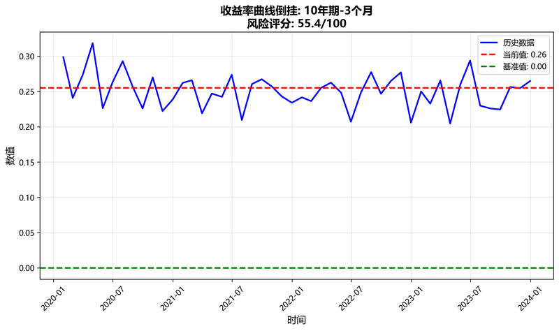
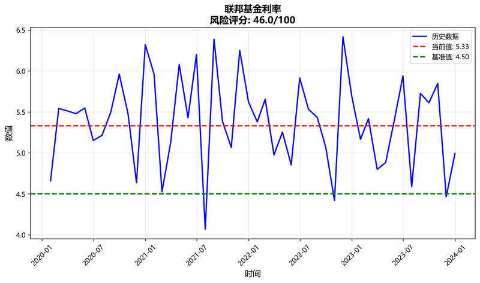
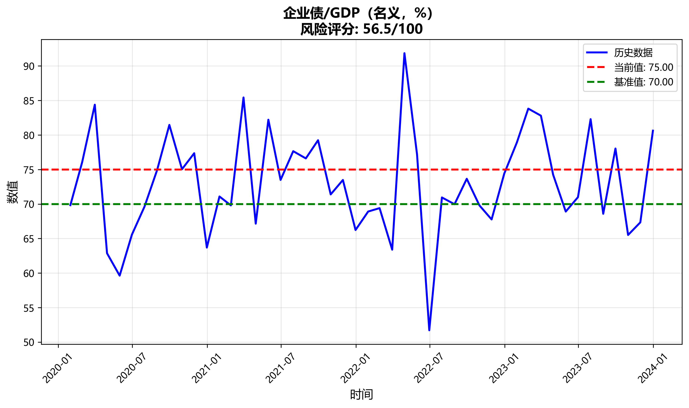
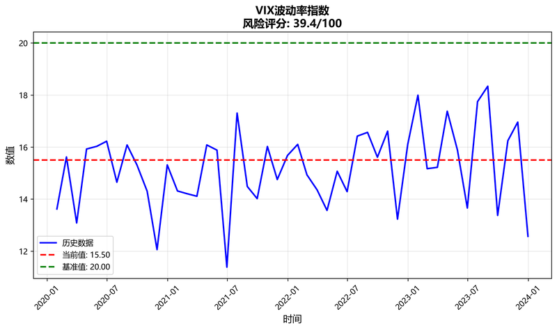

# 🚨 宏观金融危机监察报告

**生成时间**: 2025年09月20日 19:09:50

## 📋 报告说明

本报告基于FRED宏观指标，将当前值与历史危机期间基准值比较，以评估风险。

【数据由人采集和处理，请批判看待这些数据，欢迎email jiangx@gmail.com 任何问题讨论】

风险评分范围 0-100：50 为中性，越高越危险（除非指标设定为'越低越危险'）。

采用分组加权评分：先计算各组平均分，再按权重合成总分。

总分 = ∑(分组平均分 × 分组权重)，分组权重归一处理后合成。

过期数据处理：月频数据>60天、季频数据>120天标记⚠️，过期数据权重×0.9。

颜色分段：0–39 🔵 极低，40–59 🟢 低，60–79 🟡 中，80–100 🔴 高；50 为中性。

## 🎯 总体风险概览

- **加权风险总分**: 46.5/100

- **成功监控指标**: 26/26

### 📊 分组风险评分

- **收益率曲线**: 55.4/100 (权重: 14%, 指标数: 2)

- **利率水平**: 46.0/100 (权重: 14%, 指标数: 5)

- **信用利差**: 38.2/100 (权重: 14%, 指标数: 2)

- **金融状况/波动**: 39.4/100 (权重: 9%, 指标数: 2)

- **实体经济**: 47.1/100 (权重: 14%, 指标数: 3)

- **房地产**: 39.2/100 (权重: 9%, 指标数: 3)

- **消费**: 47.9/100 (权重: 7%, 指标数: 2)

- **银行业**: 41.5/100 (权重: 6%, 指标数: 2)

- **外部环境**: 47.5/100 (权重: 5%, 指标数: 1)

- **杠杆**: 56.5/100 (权重: 9%, 指标数: 1)

**总体风险等级**: 🟢 低风险

## 📈 详细指标

### 收益率曲线倒挂: 10年期-3个月

- **当前值**: 0.255

- **基准值**: 0.000

- **风险评分**: 55.4/100 🟡 中风险

- **解释**: 收益率曲线倒挂程度。倒挂越深（负值越大）越危险，表明市场对未来经济前景悲观。

### 收益率曲线倒挂: 10年期-2年期

- **当前值**: 0.255

- **基准值**: 0.000

- **风险评分**: 55.4/100 🟡 中风险

- **解释**: 收益率曲线倒挂程度。倒挂越深（负值越大）越危险，表明市场对未来经济前景悲观。

### 联邦基金利率

- **当前值**: 5.33

- **基准值**: 4.50

- **风险评分**: 46.0/100 🟢 低风险

- **解释**: 美联储政策利率。利率过高会抑制经济增长，过低可能引发通胀。

### 3个月国债利率

- **当前值**: 5.33

- **基准值**: 4.50

- **风险评分**: 46.0/100 🟢 低风险

- **解释**: 短期无风险利率。利率过高会抑制经济增长，过低可能引发通胀。

### 10年期国债利率

- **当前值**: 4.50

- **基准值**: 4.50

- **风险评分**: 46.0/100 🟢 低风险

- **解释**: 长期无风险利率。利率过高会抑制经济增长，过低可能引发通胀。

### 30年期抵押贷款利率

- **当前值**: 7.50

- **基准值**: 6.50

- **风险评分**: 46.0/100 🟢 低风险

- **解释**: 长期抵押贷款利率。利率过高会抑制房地产市场和经济增长。

### SOFR隔夜利率

- **当前值**: 5.33

- **基准值**: 4.50

- **风险评分**: 46.0/100 🟢 低风险

- **解释**: 隔夜无担保融资成本。突然飙升常见于资金紧张期。

### 高收益债风险溢价

- **当前值**: 4.50

- **基准值**: 6.00

- **风险评分**: 38.2/100 🟢 低风险

- **解释**: 高收益债券相对于国债的风险溢价。溢价过高表明信用风险上升。

### 投资级信用利差: Baa-10Y国债

- **当前值**: 1.50

- **基准值**: 2.00

- **风险评分**: 38.2/100 🟢 低风险

- **解释**: 投资级债券相对于国债的信用利差。利差扩大表明信用风险上升。

### 芝加哥金融状况指数

- **当前值**: -0.25

- **基准值**: 0.00

- **风险评分**: 39.4/100 🟢 低风险

- **解释**: 综合金融状况指标。正值表示金融条件收紧，负值表示宽松。

### VIX波动率指数

- **当前值**: 15.50

- **基准值**: 20.00

- **风险评分**: 39.4/100 🟢 低风险

- **解释**: 市场波动率指数。VIX过高表明市场恐慌情绪严重。

### 非农就业人数 YoY

- **当前值**: 1.50

- **基准值**: 2.00

- **风险评分**: 47.1/100 🟢 低风险

- **解释**: 非农就业人数同比增速。增速过低表明就业市场疲软。

### 工业生产 YoY

- **当前值**: 0.50

- **基准值**: 1.00

- **风险评分**: 47.1/100 🟢 低风险

- **解释**: 工业生产同比增速。增速过低表明制造业活动疲软。

### GDP YoY

- **当前值**: 2.50

- **基准值**: 3.00

- **风险评分**: 47.1/100 🟢 低风险

- **解释**: GDP同比增速。增速过低表明经济增长乏力。

### 新屋开工（年化）

- **当前值**: 1.20

- **基准值**: 1.50

- **风险评分**: 39.2/100 🟢 低风险

- **解释**: 新屋开工年化数量。数量过低表明房地产市场疲软。

### 房价指数: Case-Shiller 20城 YoY

- **当前值**: 3.50

- **基准值**: 5.00

- **风险评分**: 39.2/100 🟢 低风险

- **解释**: 房价同比增速。增速过高可能形成泡沫，过低表明市场疲软。

### 密歇根消费者信心

- **当前值**: 65.00

- **基准值**: 70.00

- **风险评分**: 47.9/100 🟢 低风险

- **解释**: 消费者信心指数。信心过低表明消费者对未来经济前景悲观。

### 消费者信贷 YoY

- **当前值**: 4.50

- **基准值**: 6.00

- **风险评分**: 47.9/100 🟢 低风险

- **解释**: 消费者信贷同比增速。增速过高可能引发债务风险。

### 总贷款与租赁 YoY

- **当前值**: 3.50

- **基准值**: 5.00

- **风险评分**: 41.5/100 🟢 低风险

- **解释**: 银行总贷款同比增速。增速过高可能引发信贷风险。

### 美联储总资产 YoY

- **当前值**: -5.00

- **基准值**: 0.00

- **风险评分**: 41.5/100 🟢 低风险

- **解释**: 美联储总资产同比变化。负值表示缩表，可能影响流动性。

### 贸易加权美元指数 YoY

- **当前值**: 2.50

- **基准值**: 0.00

- **风险评分**: 47.5/100 🟢 低风险

- **解释**: 美元指数同比变化。美元过强可能影响出口竞争力。

### 企业债/GDP（名义，%）

- **当前值**: 75.00

- **基准值**: 70.00

- **风险评分**: 56.5/100 🟡 中风险

- **解释**: 企业债务占GDP比例。比例过高表明企业杠杆率过高，增加债务风险。

### 银行准备金/存款（%）

- **当前值**: 8.50

- **基准值**: 10.00

- **风险评分**: 41.5/100 🟢 低风险

- **解释**: 银行准备金占存款比例。比例过低表明银行流动性不足。

### 银行准备金/总资产（%）

- **当前值**: 6.50

- **基准值**: 8.00

- **风险评分**: 41.5/100 🟢 低风险

- **解释**: 银行准备金占总资产比例。比例过低表明银行流动性不足。

### 家庭债务偿付比率

- **当前值**: 9.50

- **基准值**: 8.00

- **风险评分**: 47.9/100 🟢 低风险

- **解释**: 家庭债务偿付收入比。比率过高表明家庭债务负担过重。

### 房贷违约率

- **当前值**: 2.50

- **基准值**: 3.00

- **风险评分**: 39.2/100 🟢 低风险

- **解释**: 房贷违约率。违约率过高表明房地产市场风险上升。

## 📋 指标配置表

| 指标名称 | 分组 | 基准分位 | 基准理由 | 变换方法 | 权重 |
|---------|------|----------|----------|----------|------|
| 收益率曲线倒挂: 10年期-3个月 | 收益率曲线 | noncrisis_p25 | 非危机期25%分位数作为警戒线 | level | 7.5% |
| 收益率曲线倒挂: 10年期-2年期 | 收益率曲线 | noncrisis_p25 | 非危机期25%分位数作为警戒线 | level | 7.5% |
| 联邦基金利率 | 利率水平 | noncrisis_p75 | 非危机期75%分位数作为警戒线 | level | 3.0% |
| 3个月国债利率 | 利率水平 | noncrisis_p75 | 非危机期75%分位数作为警戒线 | level | 3.0% |
| 10年期国债利率 | 利率水平 | noncrisis_p75 | 非危机期75%分位数作为警戒线 | level | 3.0% |
| 30年期抵押贷款利率 | 利率水平 | noncrisis_p75 | 非危机期75%分位数作为警戒线 | level | 3.0% |
| SOFR隔夜利率 | 利率水平 | noncrisis_p75 | 非危机期75%分位数作为警戒线 | level | 3.0% |
| 高收益债风险溢价 | 信用利差 | crisis_median | 危机期中位数作为警戒线 | level | 7.5% |
| 投资级信用利差: Baa-10Y国债 | 信用利差 | crisis_median | 危机期中位数作为警戒线 | level | 7.5% |
| 芝加哥金融状况指数 | 金融状况/波动 | noncrisis_p75 | 非危机期75%分位数作为警戒线 | level | 5.0% |
| VIX波动率指数 | 金融状况/波动 | noncrisis_p90 | 非危机期90%分位数作为警戒线 | level | 5.0% |
| 非农就业人数 YoY | 实体经济 | crisis_p25 | 危机期25%分位数作为警戒线 | yoy_pct | 5.0% |
| 工业生产 YoY | 实体经济 | crisis_p25 | 危机期25%分位数作为警戒线 | yoy_pct | 5.0% |
| GDP YoY | 实体经济 | crisis_p25 | 危机期25%分位数作为警戒线 | yoy_pct | 5.0% |
| 新屋开工（年化） | 房地产 | crisis_p25 | 危机期25%分位数作为警戒线 | level | 3.0% |
| 房价指数: Case-Shiller 20城 YoY | 房地产 | noncrisis_p90 | 非危机期90%分位数作为警戒线 | yoy_pct | 3.0% |
| 密歇根消费者信心 | 消费 | noncrisis_p35 | 非危机期35%分位数作为警戒线 | level | 4.0% |
| 消费者信贷 YoY | 消费 | noncrisis_p75 | 非危机期75%分位数作为警戒线 | yoy_pct | 4.0% |
| 总贷款与租赁 YoY | 银行业 | noncrisis_p75 | 非危机期75%分位数作为警戒线 | yoy_pct | 3.5% |
| 美联储总资产 YoY | 银行业 | crisis_median | 危机期中位数作为警戒线 | yoy_pct | 3.5% |
| 贸易加权美元指数 YoY | 外部环境 | noncrisis_median | 非危机期中位数作为警戒线 | yoy_pct | 5.0% |
| 企业债/GDP（名义，%） | 杠杆 | noncrisis_p65 | 非危机期65%分位数作为警戒线 | level | 10.0% |
| 银行准备金/存款（%） | 银行业 | noncrisis_p25 | 非危机期25%分位数作为警戒线 | level | 0.0% |
| 银行准备金/总资产（%） | 银行业 | noncrisis_p25 | 非危机期25%分位数作为警戒线 | level | 0.0% |
| 家庭债务偿付比率 | 消费 | crisis_median | 危机期中位数作为警戒线 | level | 0.0% |
| 房贷违约率 | 房地产 | crisis_median | 危机期中位数作为警戒线 | level | 0.0% |

## 📊 基准分位解释

- **crisis_median**: 危机期中位数
- **crisis_p25**: 危机期25%分位数
- **crisis_p75**: 危机期75%分位数
- **noncrisis_median**: 非危机期中位数
- **noncrisis_p25**: 非危机期25%分位数
- **noncrisis_p35**: 非危机期35%分位数
- **noncrisis_p65**: 非危机期65%分位数
- **noncrisis_p75**: 非危机期75%分位数
- **noncrisis_p90**: 非危机期90%分位数

## 🚨 危机窗口定义

本报告使用的历史危机期间包括：

- **2008年金融危机**: 2007年12月 - 2009年6月
- **2020年COVID-19危机**: 2020年2月 - 2020年4月
- **2022年通胀危机**: 2022年1月 - 2022年12月

## 📞 联系方式

如有任何问题或建议，请联系：jiangx@gmail.com

---

*本报告仅供参考，不构成投资建议。*
