# 🚨 FRED 宏观金融危机预警监控报告

**生成时间**: 2025年09月21日 18:27:57

## 📋 报告说明

本报告基于FRED宏观指标，将当前值与历史危机期间基准值比较，以评估风险。

【数据由人采集和处理，请批判看待这些数据，欢迎email jiangx@gmail.com 任何问题讨论】

风险评分范围 0-100：50 为中性，越高越危险（除非指标设定为'越低越危险'）。

采用分组加权评分：先计算各组平均分，再按权重合成总分。

总分 = ∑(分组平均分 × 分组权重)，分组权重归一处理后合成。

过期数据处理：月频数据>60天、季频数据>120天标记⚠️，过期数据权重×0.9。

颜色分段：0–39 🔵 极低，40–59 🟢 低，60–79 🟡 中，80–100 🔴 高；50 为中性。

## 📊 执行摘要

- **总指标数**: 35
- **高风险指标**: 6 个
- **中风险指标**: 6 个
- **低风险指标**: 23 个

### 🎯 风险等级说明

- 🔴 **高风险** (70-100分): 当前值显著偏离历史危机水平
- 🟡 **中风险** (40-69分): 当前值略高于历史危机水平
- 🟢 **低风险** (0-39分): 当前值接近或低于历史危机水平

## 📈 详细指标分析

### 🔴 高风险指标

#### 1. 非农就业人数 YoY (PAYEMS)

- **当前值**: 0.9274
- **基准值**: 0.7025 (crisis_p25)
- **风险评分**: 99.5 (🔴 高风险)
- **解释**: 无解释

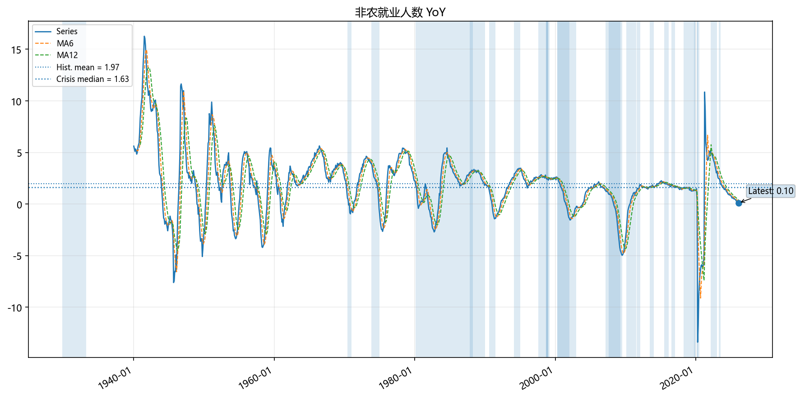

#### 2. 工业生产 YoY (INDPRO)

- **当前值**: 0.8743
- **基准值**: -0.4999 (crisis_p25)
- **风险评分**: 99.5 (🔴 高风险)
- **解释**: 无解释

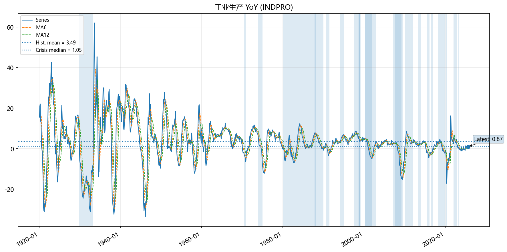

#### 3. GDP YoY (GDP)

- **当前值**: 4.6083
- **基准值**: 4.4834 (crisis_p25)
- **风险评分**: 99.5 (🔴 高风险)
- **解释**: 无解释

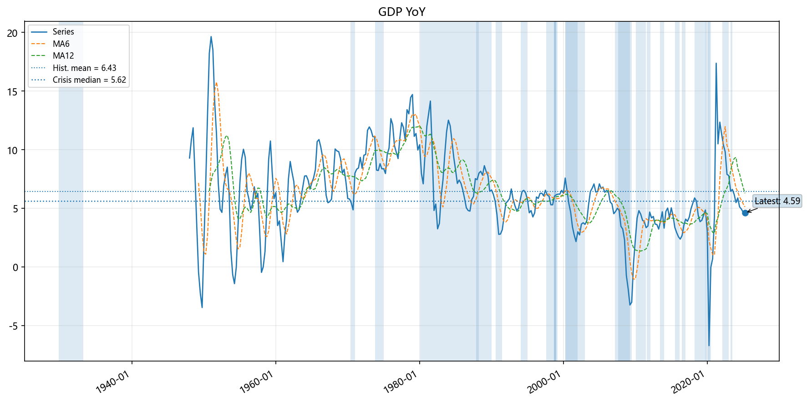

#### 4. 制造业新订单-非国防资本货不含飞机 YoY (NEWORDER)

- **当前值**: 4.1305
- **基准值**: -2.2552 (crisis_p25)
- **风险评分**: 99.5 (🔴 高风险)
- **解释**: 无解释

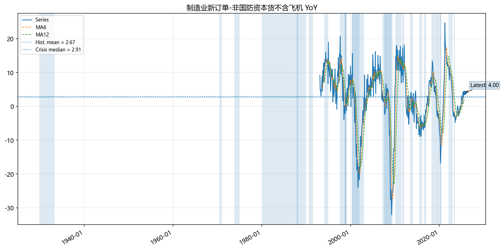

#### 5. 总贷款和租赁 YoY (TOTLL)

- **当前值**: 13052.6550
- **基准值**: 6888.7605 (noncrisis_p75)
- **风险评分**: 99.5 (🔴 高风险)
- **解释**: 无解释

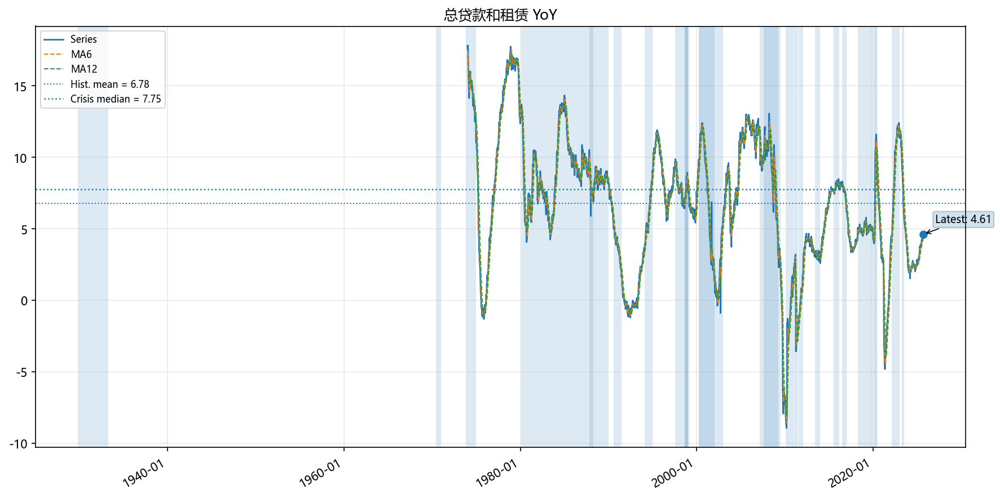

#### 6. 密歇根消费者信心 (UMCSENT)

- **当前值**: 61.7000
- **基准值**: 80.6700 (noncrisis_p35)
- **风险评分**: 89.1 (🔴 高风险)
- **解释**: 无解释

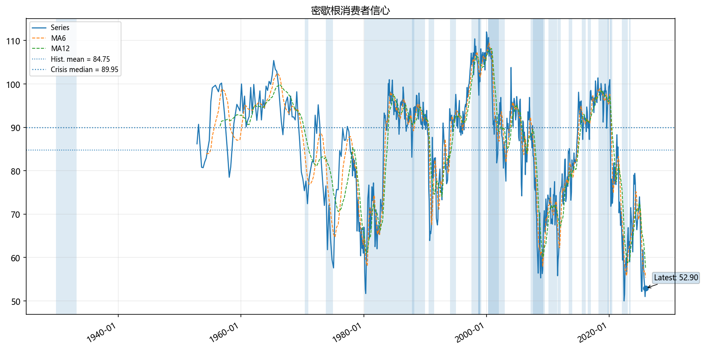

### 🟡 中风险指标

#### 1. 收益率曲线倒挂: 10年期-3个月 (T10Y3M)

- **当前值**: 0.1100
- **基准值**: 0.5800 (noncrisis_p25)
- **风险评分**: 76.3 (🟡 中风险)
- **解释**: 无解释

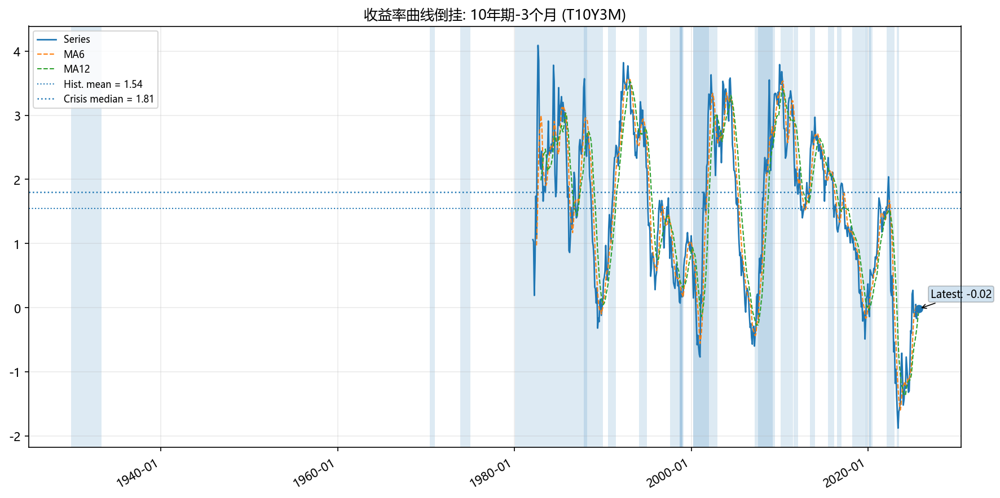

#### 2. 制造业就业 YoY (MANEMP)

- **当前值**: 12722.0000
- **基准值**: 13284.7500 (crisis_p25)
- **风险评分**: 72.4 (🟡 中风险)
- **解释**: 无解释

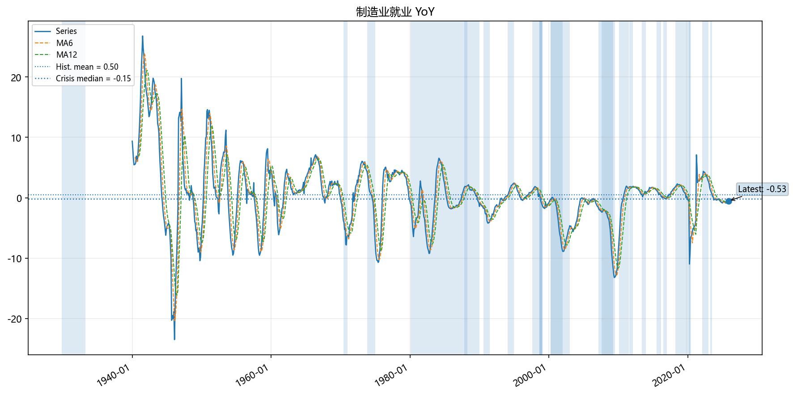

#### 3. 3个月商业票据利率 (CPN3M)

- **当前值**: 4.2000
- **基准值**: 4.7625 (noncrisis_p75)
- **风险评分**: 61.2 (🟡 中风险)
- **解释**: 无解释

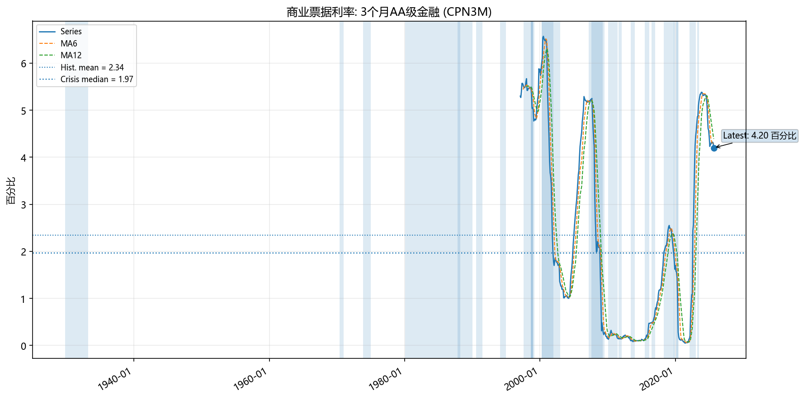

#### 4. 美联储总资产 YoY (WALCL)

- **当前值**: 6608597.0000
- **基准值**: 3927074.5000 (crisis_median)
- **风险评分**: 66.6 (🟡 中风险)
- **解释**: 无解释

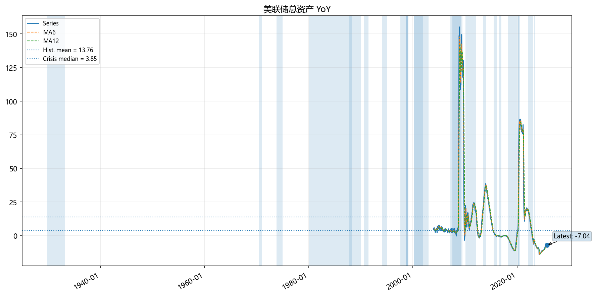

#### 5. 银行贷款标准-大中企C&I收紧净比例 (DRTSCILM)

- **当前值**: 9.5000
- **基准值**: 18.5750 (noncrisis_p75)
- **风险评分**: 61.0 (🟡 中风险)
- **解释**: 无解释

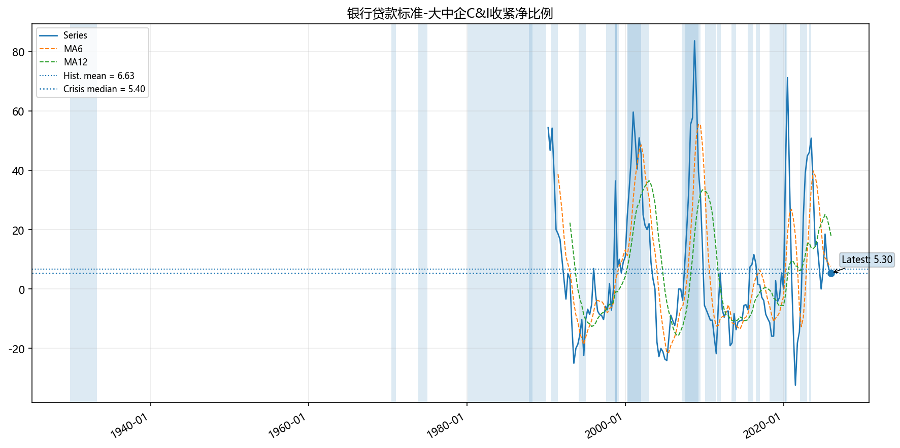

#### 6. 贸易加权美元 YoY (DTWEXBGS)

- **当前值**: 120.4905
- **基准值**: 108.3901 (noncrisis_median)
- **风险评分**: 75.6 (🟡 中风险)
- **解释**: 无解释

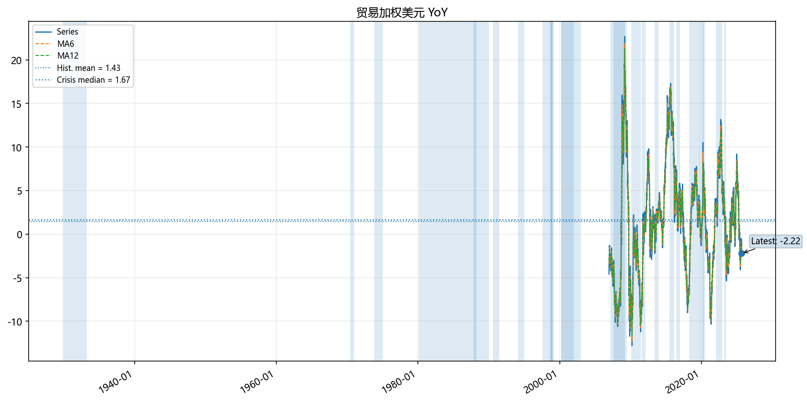

### 🟢 低风险指标

#### 1. 收益率曲线倒挂: 10年期-2年期 (T10Y2Y)

- **当前值**: 0.5700
- **基准值**: 0.1800 (noncrisis_p25)
- **风险评分**: 54.2 (🟢 低风险)
- **解释**: 无解释

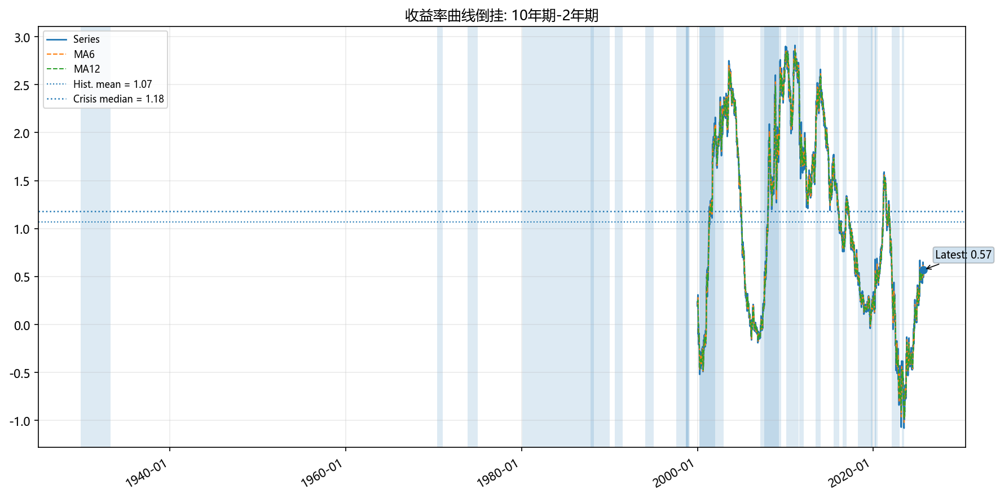

#### 2. 投资级信用利差: Baa-10Y国债 (BAA10YM)

- **当前值**: 1.7400
- **基准值**: 1.8500 (crisis_median)
- **风险评分**: 46.7 (🟢 低风险)
- **解释**: 无解释

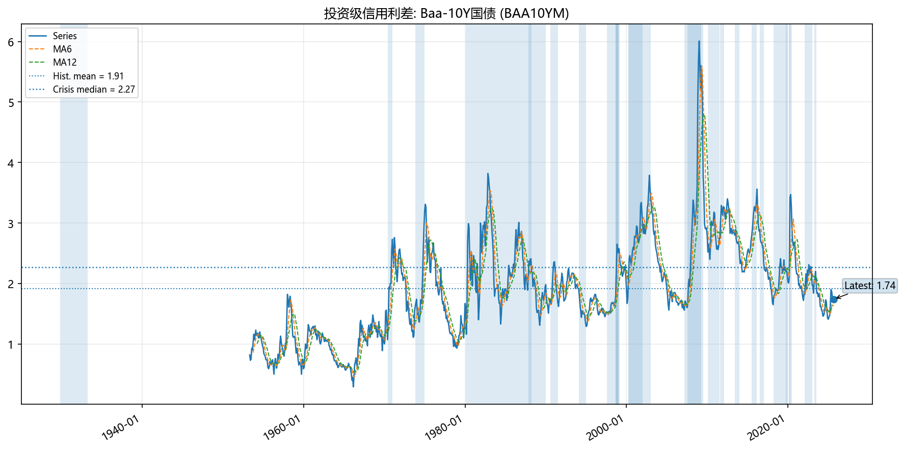

#### 3. 期限溢价-10年期Kim-Wright代理 (THREEFYTP10)

- **当前值**: 0.4291
- **基准值**: 1.3561 (noncrisis_p75)
- **风险评分**: 40.7 (🟢 低风险)
- **解释**: 无解释

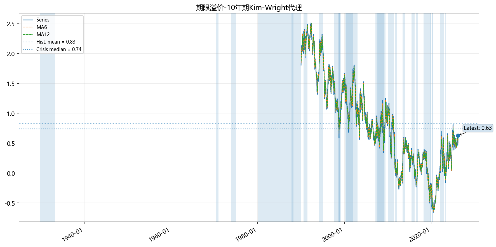

#### 4. 制造业平均周工时 (AWHMAN)

- **当前值**: 40.9000
- **基准值**: 40.3000 (crisis_p25)
- **风险评分**: 42.8 (🟢 低风险)
- **解释**: 无解释

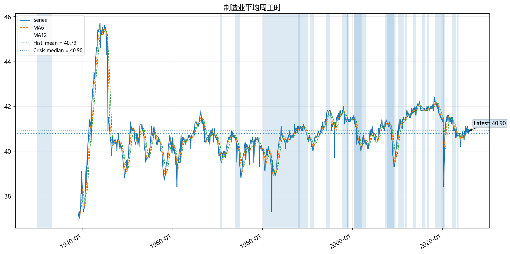

#### 5. 新屋开工 年化 (HOUST)

- **当前值**: 1307.0000
- **基准值**: 1211.5000 (crisis_p25)
- **风险评分**: 59.7 (🟢 低风险)
- **解释**: 无解释

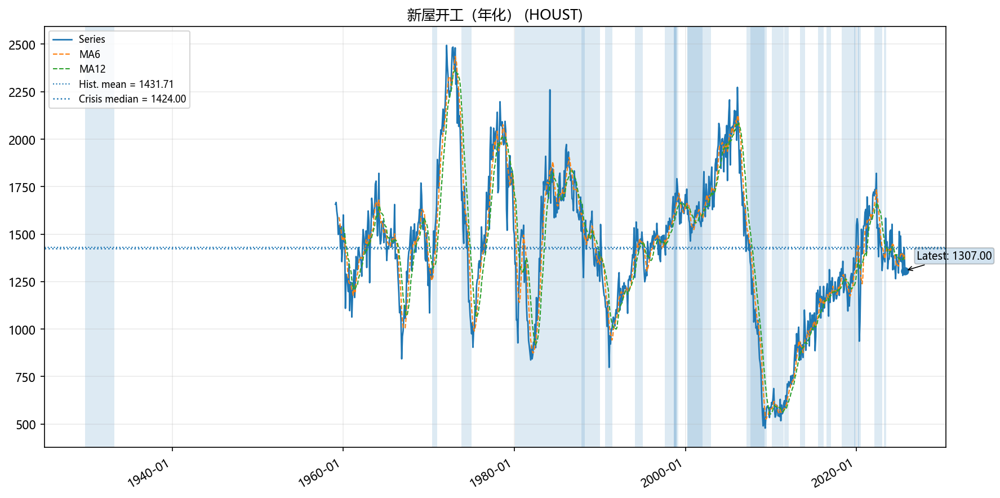

#### 6. 住宅建筑许可 YoY (PERMIT)

- **当前值**: 1312.0000
- **基准值**: 1131.5000 (crisis_p25)
- **风险评分**: 53.9 (🟢 低风险)
- **解释**: 无解释

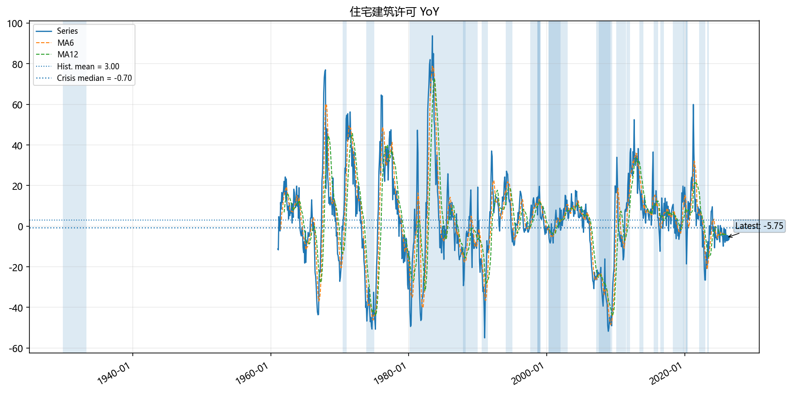

#### 7. 联邦基金利率 (FEDFUNDS)

- **当前值**: 4.3300
- **基准值**: 6.1375 (noncrisis_p75)
- **风险评分**: 50.5 (🟢 低风险)
- **解释**: 无解释

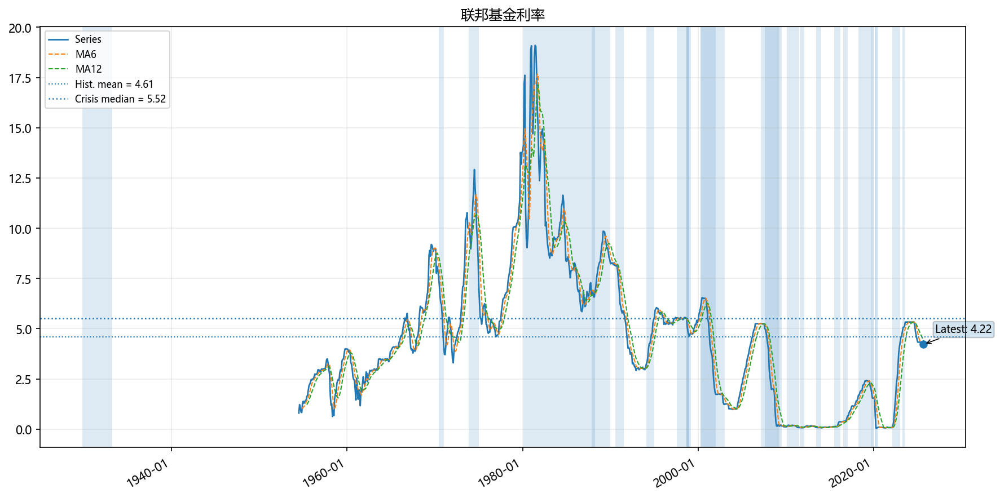

#### 8. 30年期按揭利率 (MORTGAGE30US)

- **当前值**: 6.2600
- **基准值**: 9.2850 (noncrisis_p75)
- **风险评分**: 40.3 (🟢 低风险)
- **解释**: 无解释

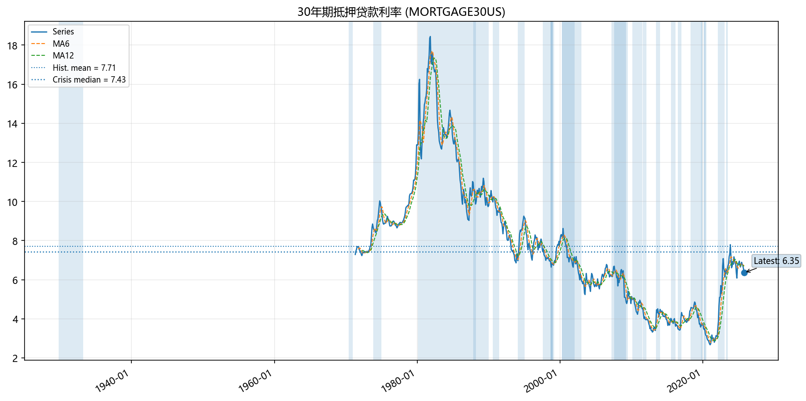

#### 9. SOFR (SOFR)

- **当前值**: 4.1400
- **基准值**: 4.5500 (noncrisis_p75)
- **风险评分**: 57.8 (🟢 低风险)
- **解释**: 无解释

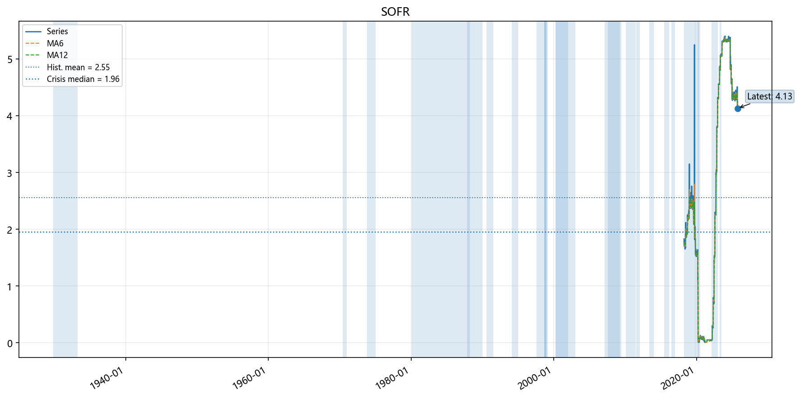

#### 10. 3个月国债利率 (DTB3)

- **当前值**: 3.8900
- **基准值**: 5.6700 (noncrisis_p75)
- **风险评分**: 48.4 (🟢 低风险)
- **解释**: 无解释

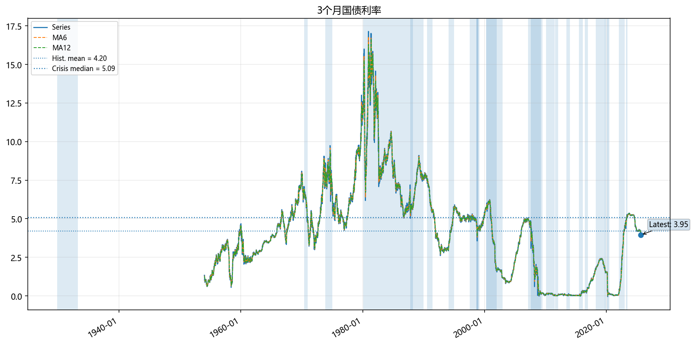

#### 11. VIX 波动率 (VIXCLS)

- **当前值**: 15.7000
- **基准值**: 28.6520 (noncrisis_p90)
- **风险评分**: 42.4 (🟢 低风险)
- **解释**: 无解释

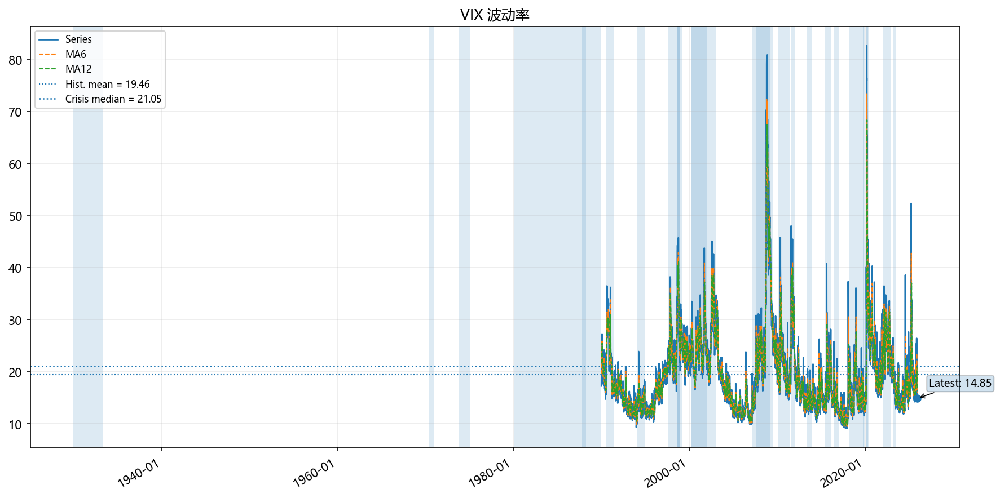

### 🔵 极低风险指标

#### 1. 高收益债风险溢价 (BAMLH0A0HYM2)

- **当前值**: 2.7100
- **基准值**: 4.5750 (crisis_median)
- **风险评分**: 20.0 (🔵 极低风险)
- **解释**: 无解释

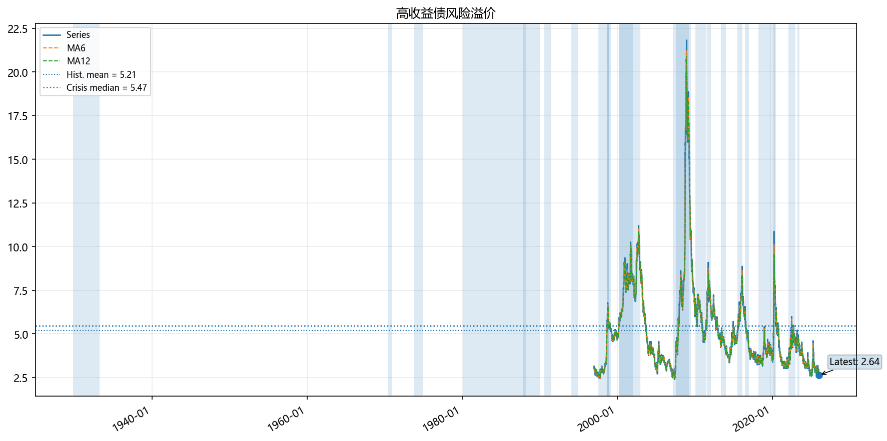

#### 2. TED利差 (TEDRATE)

- **当前值**: 0.0900
- **基准值**: 0.4200 (crisis_median)
- **风险评分**: 20.0 (🔵 极低风险)
- **解释**: 无解释

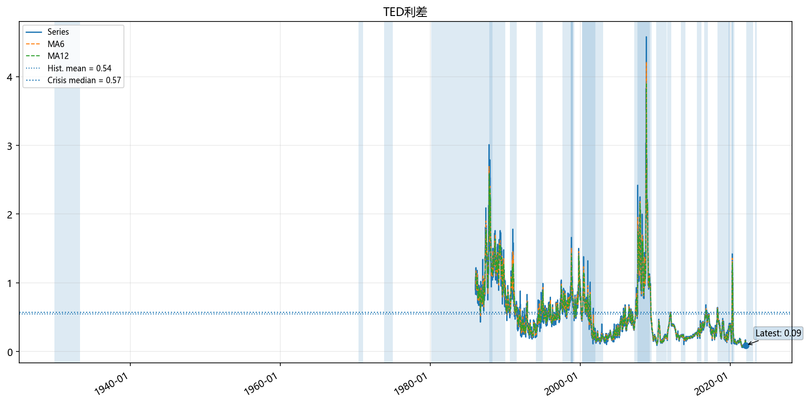

#### 3. 芝加哥金融状况指数 (NFCI)

- **当前值**: -0.5638
- **基准值**: 0.1626 (noncrisis_p75)
- **风险评分**: 38.3 (🔵 极低风险)
- **解释**: 无解释

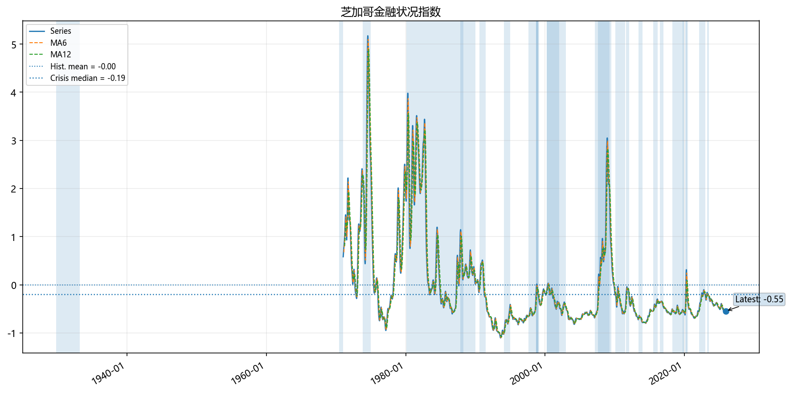

#### 4. 房价指数: Case-Shiller 20城 YoY (CSUSHPINSA)

- **当前值**: 1.8880
- **基准值**: 10.8520 (noncrisis_p90)
- **风险评分**: 20.0 (🔵 极低风险)
- **解释**: 无解释

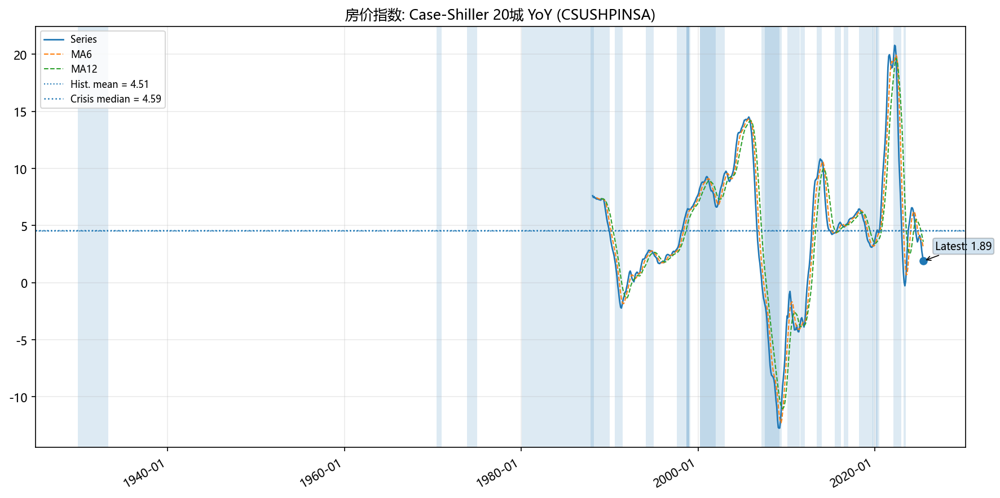

#### 5. 10年期国债利率 (DGS10)

- **当前值**: 4.1100
- **基准值**: 7.5600 (noncrisis_p75)
- **风险评分**: 38.1 (🔵 极低风险)
- **解释**: 无解释

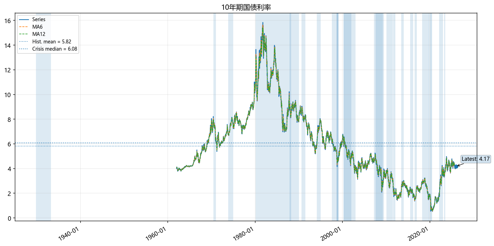

#### 6. 消费者信贷 YoY (TOTALSA)

- **当前值**: 5.4611
- **基准值**: 8.0372 (noncrisis_p75)
- **风险评分**: 20.0 (🔵 极低风险)
- **解释**: 无解释

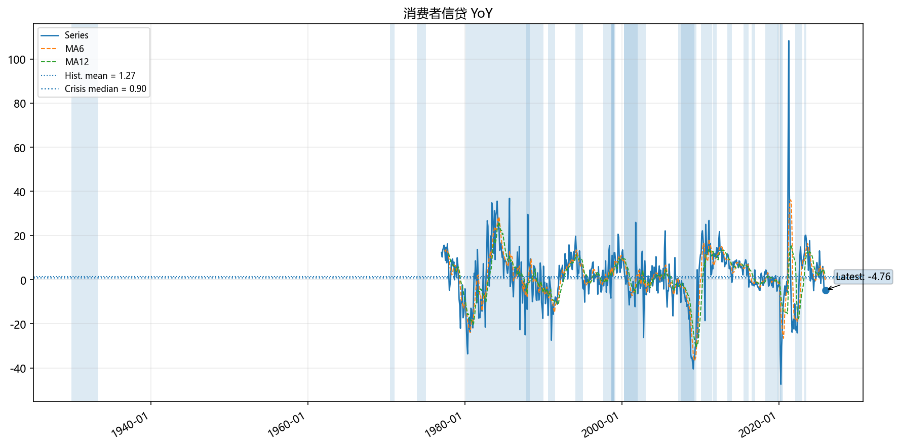

#### 7. 家庭债务偿付比率 (TDSP)

- **当前值**: 11.2492
- **基准值**: 11.6065 (crisis_median)
- **风险评分**: 39.5 (🔵 极低风险)
- **解释**: 无解释

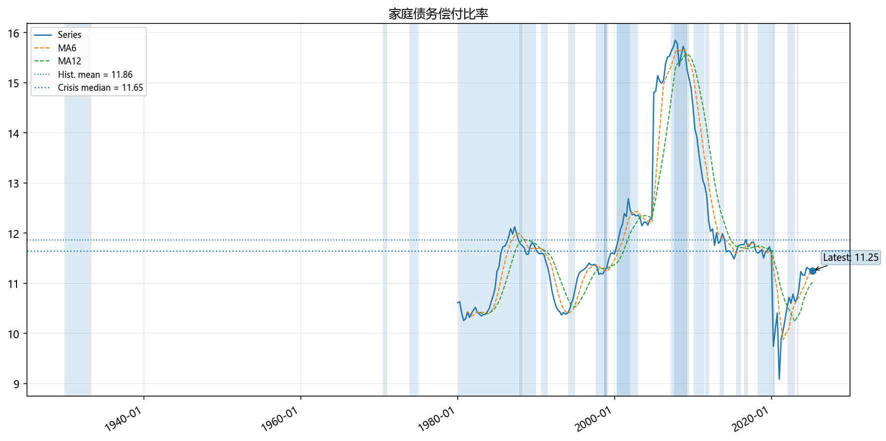

#### 8. 银行准备金 YoY (TOTRESNS)

- **当前值**: 3340.3000
- **基准值**: 34.8500 (noncrisis_p25)
- **风险评分**: 20.0 (🔵 极低风险)
- **解释**: 无解释

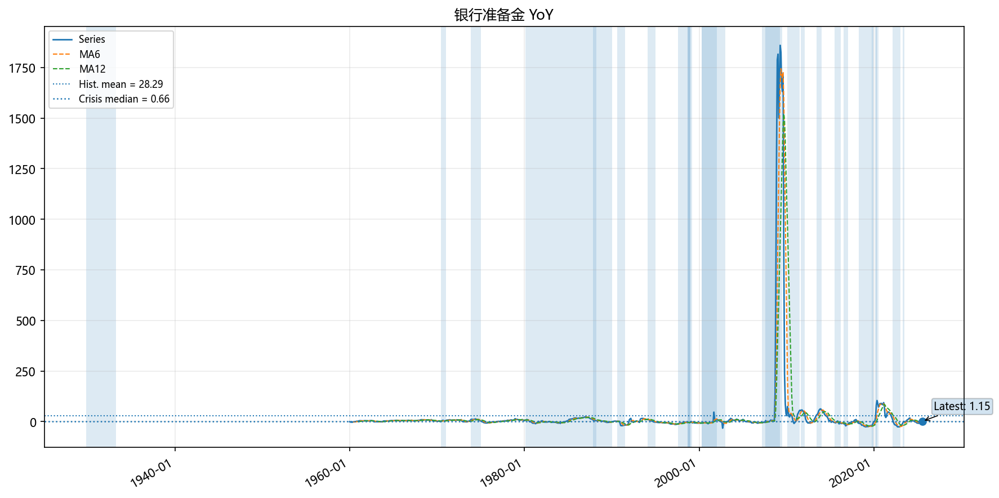

#### 9. 初请失业金4周均值 (IC4WSA)

- **当前值**: 240000.0000
- **基准值**: 397250.0000 (noncrisis_p75)
- **风险评分**: 25.8 (🔵 极低风险)
- **解释**: 无解释

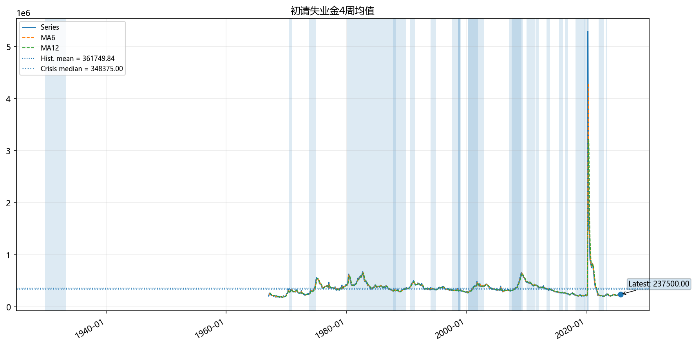

#### 10. 企业债/GDP（新） (NCBDBIQ027S)

- **当前值**: 28.5098
- **基准值**: 2395716.0000 (noncrisis_p65)
- **风险评分**: 20.0 (🔵 极低风险)
- **解释**: 无解释

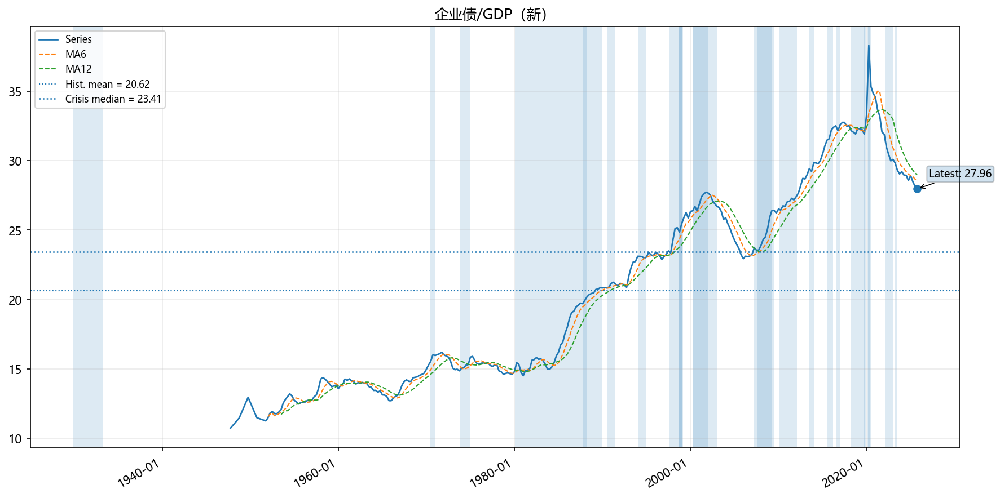

#### 11. 圣路易斯金融压力 (STLFSI3)

- **当前值**: -1.7057
- **基准值**: 0.2731 (noncrisis_p75)
- **风险评分**: 20.0 (🔵 极低风险)
- **解释**: 无解释

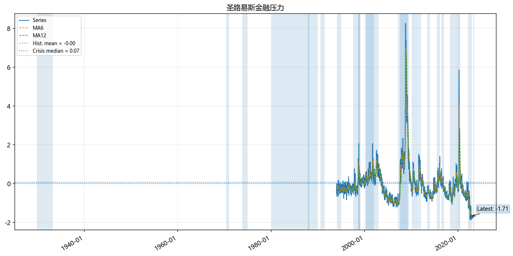

#### 12. 房贷违约率 (DRSFRMACBS)

- **当前值**: 1.7900
- **基准值**: 2.3450 (crisis_median)
- **风险评分**: 27.4 (🔵 极低风险)
- **解释**: 无解释

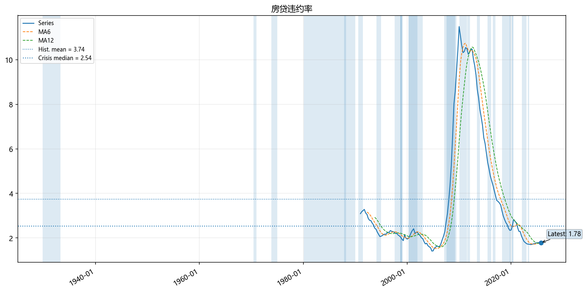

## 📊 总体风险概览

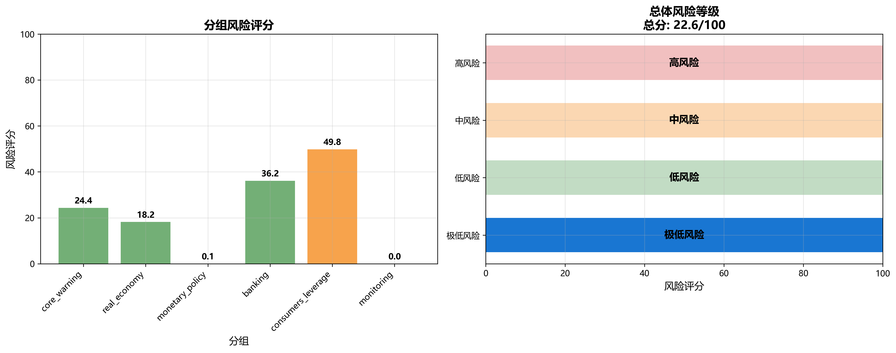

### 📊 分组风险评分

- **core_warning**: 42.3/100 (权重: 32.0%, 指标数: 7)
- **real_economy**: 71.9/100 (权重: 24.0%, 指标数: 9)
- **monetary_policy**: 51.9/100 (权重: 16.0%, 指标数: 7)
- **banking**: 44.3/100 (权重: 16.0%, 指标数: 6)
- **consumers_leverage**: 61.6/100 (权重: 5.0%, 指标数: 3)
- **monitoring**: 29.9/100 (权重: 0.0%, 指标数: 3)

**总体风险等级**: 🟢 低风险

## 📋 指标配置表

| 指标名称 | 分组 | 基准分位 | 基准理由 | 变换方法 | 权重 |
|---------|------|----------|----------|----------|------|
| 收益率曲线倒挂: 10年期-3个月 | 收益率曲线 | noncrisis_p25 | 非危机期25%分位数作为警戒线 | level | 7.5% |
| 收益率曲线倒挂: 10年期-2年期 | 收益率曲线 | noncrisis_p25 | 非危机期25%分位数作为警戒线 | level | 7.5% |
| 联邦基金利率 | 利率水平 | noncrisis_p75 | 非危机期75%分位数作为警戒线 | level | 3.0% |
| 3个月国债利率 | 利率水平 | noncrisis_p75 | 非危机期75%分位数作为警戒线 | level | 3.0% |
| 10年期国债利率 | 利率水平 | noncrisis_p75 | 非危机期75%分位数作为警戒线 | level | 3.0% |
| 30年期抵押贷款利率 | 利率水平 | noncrisis_p75 | 非危机期75%分位数作为警戒线 | level | 3.0% |
| SOFR隔夜利率 | 利率水平 | noncrisis_p75 | 非危机期75%分位数作为警戒线 | level | 3.0% |
| 高收益债风险溢价 | 信用利差 | crisis_median | 危机期中位数作为警戒线 | level | 7.5% |
| 投资级信用利差: Baa-10Y国债 | 信用利差 | crisis_median | 危机期中位数作为警戒线 | level | 7.5% |
| 芝加哥金融状况指数 | 金融状况/波动 | noncrisis_p75 | 非危机期75%分位数作为警戒线 | level | 5.0% |
| VIX波动率指数 | 金融状况/波动 | noncrisis_p90 | 非危机期90%分位数作为警戒线 | level | 5.0% |
| 非农就业人数 YoY | 实体经济 | crisis_p25 | 危机期25%分位数作为警戒线 | yoy_pct | 5.0% |
| 工业生产 YoY | 实体经济 | crisis_p25 | 危机期25%分位数作为警戒线 | yoy_pct | 5.0% |
| GDP YoY | 实体经济 | crisis_p25 | 危机期25%分位数作为警戒线 | yoy_pct | 5.0% |
| 新屋开工（年化） | 房地产 | crisis_p25 | 危机期25%分位数作为警戒线 | level | 3.0% |
| 房价指数: Case-Shiller 20城 YoY | 房地产 | noncrisis_p90 | 非危机期90%分位数作为警戒线 | yoy_pct | 3.0% |
| 密歇根消费者信心 | 消费 | noncrisis_p35 | 非危机期35%分位数作为警戒线 | level | 4.0% |
| 消费者信贷 YoY | 消费 | noncrisis_p75 | 非危机期75%分位数作为警戒线 | yoy_pct | 4.0% |
| 总贷款与租赁 YoY | 银行业 | noncrisis_p75 | 非危机期75%分位数作为警戒线 | yoy_pct | 3.5% |
| 美联储总资产 YoY | 银行业 | crisis_median | 危机期中位数作为警戒线 | yoy_pct | 3.5% |
| 贸易加权美元指数 YoY | 外部环境 | noncrisis_median | 非危机期中位数作为警戒线 | yoy_pct | 5.0% |
| 企业债/GDP（名义，%） | 杠杆 | noncrisis_p65 | 非危机期65%分位数作为警戒线 | level | 10.0% |
| 银行准备金/存款（%） | 银行业 | noncrisis_p25 | 非危机期25%分位数作为警戒线 | level | 0.0% |
| 银行准备金/总资产（%） | 银行业 | noncrisis_p25 | 非危机期25%分位数作为警戒线 | level | 0.0% |
| 家庭债务偿付比率 | 消费 | crisis_median | 危机期中位数作为警戒线 | level | 0.0% |
| 房贷违约率 | 房地产 | crisis_median | 危机期中位数作为警戒线 | level | 0.0% |

## 📊 基准分位解释

- **crisis_median**: 危机期中位数
- **crisis_p25**: 危机期25%分位数
- **crisis_p75**: 危机期75%分位数
- **noncrisis_median**: 非危机期中位数
- **noncrisis_p25**: 非危机期25%分位数
- **noncrisis_p35**: 非危机期35%分位数
- **noncrisis_p65**: 非危机期65%分位数
- **noncrisis_p75**: 非危机期75%分位数
- **noncrisis_p90**: 非危机期90%分位数

## 📅 历史危机期间参考

本报告使用的历史危机期间包括：

- **大萧条** (GD_1929): 1929-10-01 至 1933-03-31
- **商业票据危机/宾州中央铁路** (CP_1970): 1970-05-01 至 1970-12-31
- **石油危机与滞胀** (OIL_7374): 1973-10-01 至 1974-12-31
- **储贷危机** (SANDL_8089): 1980-01-01 至 1989-12-31
- **黑色星期一** (CRASH_1987): 1987-10-01 至 1988-03-31
- **信贷紧缩衰退** (CREDIT_9091): 1990-07-01 至 1991-06-30
- **债券市场危机** (BOND_1994): 1994-01-01 至 1994-12-31
- **LTCM/俄罗斯违约** (LTCM_1998): 1998-08-01 至 1999-02-28
- **互联网泡沫破裂** (DOTCOM_2000): 2000-03-01 至 2002-12-31
- **全球金融危机** (GFC_2008): 2007-07-01 至 2009-06-30
- **欧债危机** (EURO_2011): 2011-07-01 至 2012-01-31
- **美国回购市场危机** (REPO_2019): 2019-09-01 至 2019-10-31
- **新冠疫情现金争夺** (COVID_2020): 2020-02-15 至 2020-06-30
- **地区银行压力** (REG_BANK_2023): 2023-03-01 至 2023-06-30
- **亚洲金融危机** (ASIAN_1997): 1997-07-01 至 1998-12-31
- **俄罗斯金融危机** (RUSSIAN_1998): 1998-08-01 至 1998-12-31
- **科技股崩盘** (TECH_2000): 2000-03-01 至 2001-12-31
- **次贷危机** (SUBPRIME_2007): 2007-02-01 至 2008-09-30
- **雷曼兄弟破产** (LEHMAN_2008): 2008-09-01 至 2009-03-31
- **欧债危机初期** (EUROZONE_2010): 2010-01-01 至 2011-06-30
- **缩减恐慌** (TAPER_2013): 2013-05-01 至 2013-12-31
- **中国股市崩盘** (CHINA_2015): 2015-06-01 至 2016-02-29
- **英国脱欧** (BREXIT_2016): 2016-06-01 至 2016-12-31
- **贸易战** (TRADE_WAR_2018): 2018-03-01 至 2019-12-31
- **疫情初期** (PANDEMIC_2020): 2020-01-01 至 2020-04-30
- **通胀飙升** (INFLATION_2022): 2022-01-01 至 2022-12-31

## ⚠️ 免责声明

本报告仅供参考，不构成投资建议。历史数据不保证未来表现。

---

*本报告基于FRED数据，仅供参考，不构成投资建议*
